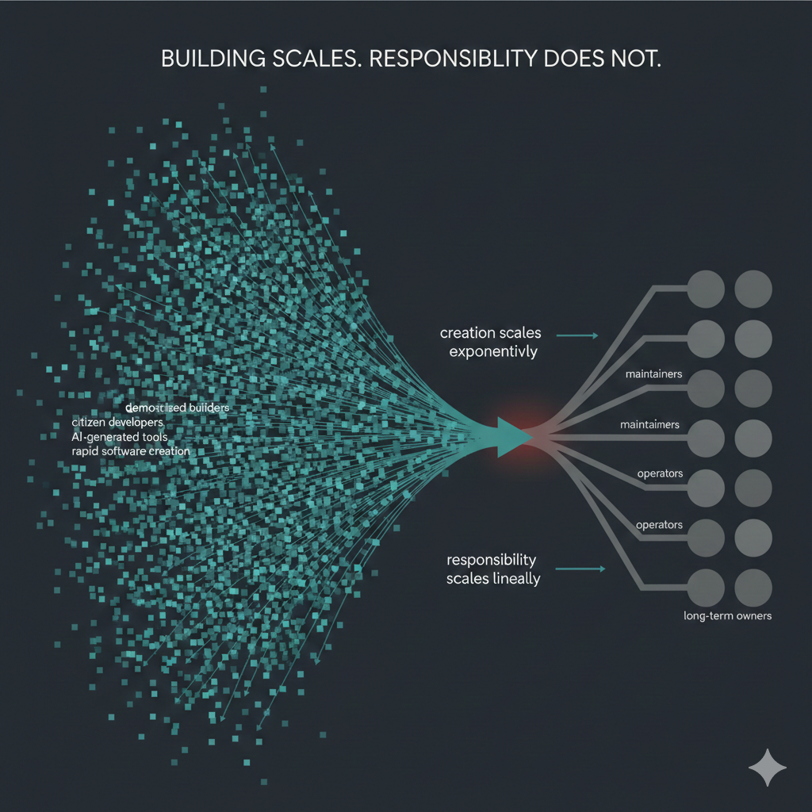
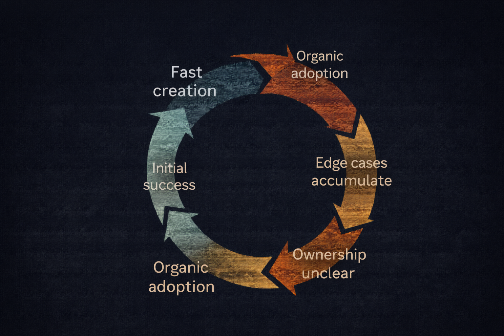

---
title: "The Democratization Paradox: Everyone Can Build, Not Everyone Should Maintain"
subtitle: "Why accessibility accelerates innovation and failure at the same time"
date: "2025-12-24T06:00:00"
series: ["What is good software?"]
part: 5
summary: "AI and no-code democratize software creation, but maintenance, ownership, and longevity remain scarce skills."
categories: ['What is good software?', 'Tech', '2025']
draft: false
--- 

## Introduction

Software creation is now radically accessible. AI-assisted coding, low-code and no-code platforms, and composable cloud services let individuals and small teams build systems that once required entire engineering departments.
This shift is real. It is valuable. And it is irreversible.

But democratization creates a structural paradox. The number of people who can build software has increased dramatically, but those who can maintain, operate, and evolve it over time have not. In many organizations, this number has declined.

This gap is no longer theoretical. It is measurable in cost, risk, and organizational fragility.

Democratization does not fail because people build too much software.
It fails because leadership does not decide what happens after building.


    

        
        
            <strong>Generated with AI</strong> ∙ 2 December 2025 at 1:47 pm
        
    



## Building Is Cheaper Than Ever. Maintenance Is Not.

AI has collapsed the cost of initial creation. Features appear quickly. Prototypes feel complete. Internal tools emerge without formal projects or architectural review.

From a leadership perspective, this looks like progress:
* faster delivery
* increased autonomy
* fewer perceived bottlenecks
* lower upfront cost

These benefits are real. They should not be dismissed.

But they apply almost exclusively to creation, not continuation.

[McKinsey estimates](https://www.mckinsey.com/capabilities/tech-and-ai/our-insights/breaking-technical-debts-vicious-cycle-to-modernize-your-business) that 40% of IT budgets are already lost to technical debt. [CISQ projects](https://www.alixpartners.com/insights/102jlar/can-ai-solve-the-rising-costs-of-technical-debt/) that this will not improve by 2025. Organizations are not paying down debt; they are compounding it.

Building has been democratized.
Responsibility has not.

## The Maintenance Talent Scarcity Problem

Maintenance is a capability, not a byproduct.

It requires skills automation does not replace:
* understanding historical decisions
* reasoning about unintended side effects
* predicting second- and third-order consequences
* managing dependencies across time
* diagnosing failures with incomplete information

These skills are learned through experience, not prompting.

Meanwhile, the supply of people capable of this work is shrinking. [IDC estimates](https://www.servicenow.com/blogs/2023/citizen-development-governance-success) a global shortfall of about 4 million developers by 2025.

Multiple surveys report that over [80% of organizations struggle](https://quixy.com/blog/future-of-citizen-development/) to attract and retain experienced software engineers.

The equation is straightforward:
* more systems are created
* fewer people can maintain them
* the ratio is unsustainable

Democratization expands surface area.
Talent scarcity amplifies fragility.

## The Ownership Transfer Problem

Most democratized systems fail at the same moment: when the original builder leaves.

Citizen-built systems rarely include:
* documentation standards
* ownership transfer protocols
* architectural context
* explicit long-term accountability

The result is institutional orphan software.

The system exists. It is used. It is often critical enough not to delete.
But no one feels responsible for it.

This directly relates to the ownership paradox described in Part 3 and the breakdown of mentorship in Part 4. Knowledge does not transfer. It dissipates.

Leadership typically discovers the problem after an incident, rather than before. At that point, the organization must choose between expensive reconstruction and risky continuation.

Neither option is strategic. Both are avoidable.


    

        
        
            <strong>Generated with AI</strong> ∙ 2 December 2025 at 1:47 pm
        
    



## Democratization and the Rise of Shadow IT and Shadow AI

Democratization is not new. Organizations have dealt with Shadow IT for decades. What has changed is the speed, autonomy, and intelligence of what is now being deployed.

[Gartner estimates](https://www.toriihq.com/blog/what-is-shadow-it) that Shadow IT already accounts for 30–40% of IT spending in large enterprises.

Everest Group places the figure closer to [50%](https://www.toriihq.com/blog/what-is-shadow-it).

By 2027, 75% of employees are expected to use technology outside formal IT oversight.
https://www.zluri.com/blog/shadow-it-statistics-key-facts-to-learn-in-2024

AI accelerates this pattern. Employees no longer deploy unsanctioned apps. They deploy autonomous agents, integrations, and decision logic.

According to the [Komprise 2025 IT Survey](https://www.cio.com/article/4083473/shadow-ai-the-hidden-agents-beyond-traditional-governance.html):
* 90% of enterprises are concerned about shadow AI from a privacy or security standpoint
* Nearly 80% have already experienced AI-related data incidents
* 13% report incidents that caused financial, customer, or reputational harm

[Gartner summarizes](https://www.cio.com/article/4083473/shadow-ai-the-hidden-agents-beyond-traditional-governance.html) the risk bluntly: unchecked AI experimentation is emerging as a critical enterprise risk

This is not a tooling failure.
It is democratization without leadership guardrails.

## The Hidden Cost Curve Becomes a Financial Curve

Democratized systems follow a predictable trajectory:
 1. fast initial success
 2. organic usage growth
 3. accumulation of edge cases
 4. operational friction
 5. unclear ownership
 6. reactive firefighting

At stages one and two, systems are celebrated.
By stage five, they quietly become “legacy”.
By stage six, they show up as cost.

[IBM reports](https://www.toriihq.com/blog/what-is-shadow-it) the average data breach cost reached $4.88 million in 2024, a 10% year-over-year increase.

One in three breaches involved shadow data, and one-third of successful cyber attacks target [shadow IT infrastructure](https://www.zluri.com/blog/shadow-it-statistics-key-facts-to-learn-in-2024).

Technical debt is no longer abstract. [MIT Sloan estimates](https://sloanreview.mit.edu/article/how-to-manage-tech-debt-in-the-ai-era/) its cost at $2.41 trillion annually in the U.S. alone.

These costs do not appear on innovation dashboards.
They surface later, under different budgets, owned by different leaders.

## Disposable by Design vs Accidental Permanence

There is nothing wrong with disposable software. Intentional disposability is healthy.
Problems arise when disposability is implicit, not explicit.
Leadership must classify systems before they are built.

## A Practical Classification Framework

Every system should be evaluated against five dimensions at creation time:
 1. Intended lifespan
Weeks, months, or years
 2. User base
Individual, team, cross-functional, enterprise
 3. Data sensitivity
None, internal, regulated.
 4. Integration depth
Standalone, API-connected, core-system dependent
 5. Replacement cost
Trivial, moderate, enterprise-scale

If leadership cannot answer these clearly, the system defaults to accidental permanence.

That is not flexibility. It is avoidance.

## Retirement Is the Hardest Leadership Decision

Most organizations are optimized to build. Very few are optimized to retire.

There are no rewards for deleting systems.
There are no metrics for avoided complexity.
There is little career credit for saying no.

As a result, systems without defined end-of-life dates become permanent by default.

Leadership must normalize:
* sunset reviews
* end-of-life checkpoints
* planned decommissioning

A system without an end date has an infinite cost curve.

## Why Leadership Avoids These Decisions

Leadership omissions are rarely accidental.

Modern organizations reward:
* speed over sustainability
* initiative over restraint
* delivery over refusal

Teams are praised for what they build, not for what they prevent or retire. As described in Part 2, misaligned metrics turn technical debt into an organizational strategy.

Part 5 shows where that debt originates.

## Connecting the Series

This article is not standalone.
* Part 1 defined the split between durable and disposable software
* Part 2 exposed the absence of leadership guardrails
* Part 3 showed how debt becomes exponential
* Part 4 demonstrated how team dynamics and mentorship erode

Part 5 explains why democratization accelerates all of these failures simultaneously when intent is missing.

## Summary

Democratization is not the problem.
Lack of intent is.

Good software in a democratized world requires leadership willing to:
* allow rapid creation
* insist on explicit ownership
* classify systems before approval
* fund maintenance deliberately
* retire systems without nostalgia

Building is easy now.
Responsibility is not.

And responsibility remains the defining characteristic of leadership.