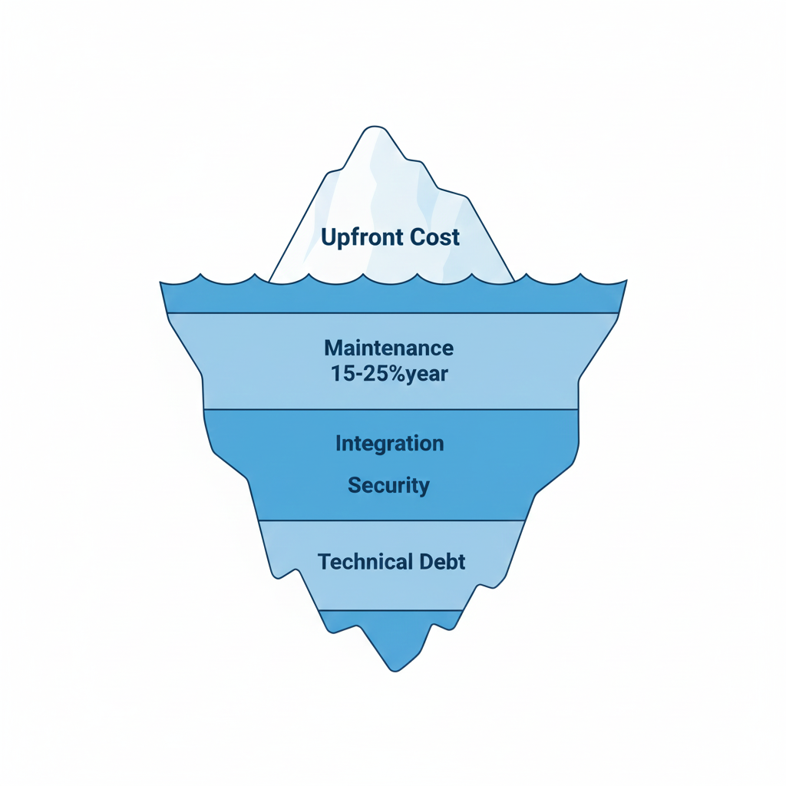
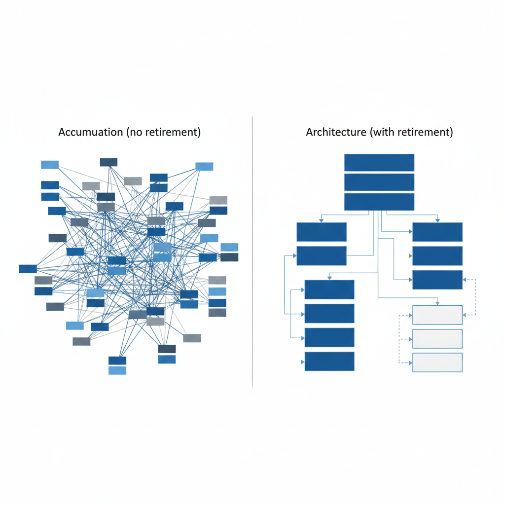
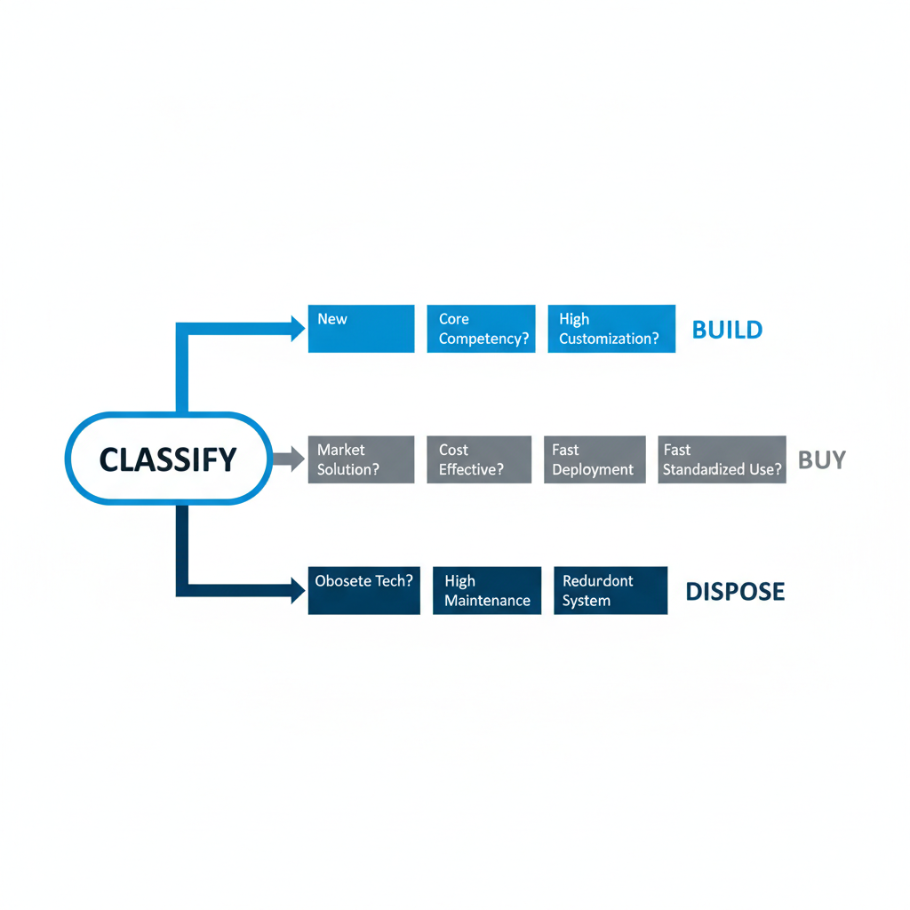

## Introduction

Many organizations say they have a software strategy.
But few have a plan for the full software lifecycle.

Most systems get approved without answering three basic questions:
* Should we build this ourselves?
* Should we buy this capability?
* Should this exist beyond a short time horizon?

People often call these decisions 'flexibility'.
But it's not flexibility, it's just avoidance.

The cost does not disappear. It appears later, under different budgets and with other leaders.

This article makes one claim explicit: build, buy, or dispose are leadership decisions. Delegating these decisions guarantees long-term failure.

⸻

## Build Is a Long-Term Commitment, Not a Project

Building software is rarely seen as a multi-year obligation.
The data is unambiguous.
* 35% of large custom software initiatives are abandoned, and only 29% are delivered successfully according to 
[Standish Group CHAOS 2024](https://neontri.com/blog/build-vs-buy-software/)
* Large IT projects run 45% over budget, 7% over time, and deliver 56% less value than promised, [McKinsey and University of Oxford](https://www.mckinsey.com/capabilities/mckinsey-digital/our-insights/delivering-large-scale-it-projects-on-time-on-budget-and-on-value)

Importantly, 78% of total lifetime software cost accrues after launch, not during development.
[Forrester Total Economic Impact 2024](https://neontri.com/blog/build-vs-buy-software/)

Leadership approving a build decision implicitly commits to:
* 15–25% annual maintenance cost relative to initial development
* long-term security ownership
* ongoing integration responsibility
* skill retention and succession planning

Any system that cannot justify these commitments should not be built.

⸻

## Buy Is an Architectural Decision, Not Procurement

Buying software does not remove responsibility. It only shifts it.
The economic reality of SaaS is often underestimated:
* True SaaS TCO increases 150–200% beyond sticker price once integration, training, and customization are included
[Gartner 2025 SaaS Economics](https://neontri.com/blog/build-vs-buy-software/)
* SaaS pricing increased 11.4% in 2025, nearly 5× market inflation
[SaaStr 2025](https://www.saastr.com/the-great-price-surge-of-2025-a-comprehensive-breakdown-of-pricing-increases-and-the-issues-they-have-created-for-all-of-us/)
* 60% of vendors mask price increases by bundling AI features
[SaaStr 2025](https://www.saastr.com/the-great-price-surge-of-2025-a-comprehensive-breakdown-of-pricing-increases-and-the-issues-they-have-created-for-all-of-us/)

Vendor lock-in is not hypothetical:
* 57% of regulated-sector organizations replaced major SaaS platforms within three years due to compliance or scaling constraints
[IDC 2024 SaaS Replacement Study](https://neontri.com/blog/build-vs-buy-software/)

Leadership must treat buy decisions as boundary choices.
If exit clauses, data portability, and replacement scenarios are not negotiated up front, they will not exist.

⸻

## The Hybrid Reality: Buy Context, Build Core

The build versus buy question is incomplete.
Modern systems are almost always hybrid:
* platforms are bought
* differentiating logic is built
* integration becomes the primary risk surface

BCG reports that 70% of digital transformation failures stem from integration problems, not from tooling choices
[BCG Digital Platform Report 2025](https://neontri.com/blog/build-vs-buy-software/)

This reframes the leadership question. It is no longer simply “build or buy?”

It is:
* what must we own to remain competitive?
* what can we safely externalize?
* how do we integrate without accumulating irreversible complexity?

Leadership must decide this deliberately. Teams cannot guess it.

⸻

## Total Cost of Ownership Is a Leadership Discipline

Most organizations still decide based on upfront cost. This is a serious error.
* 78% of software TCO accrues after launch
* Annual maintenance alone consumes 15–25% of initial build cost
* 67% of failed implementations stem from incorrect build versus buy decisions
[Forrester Software Development Trends 2024](https://fullscale.io/blog/build-vs-buy-software-development-decision-guide/)

Leadership must mandate 3–5 year TCO projections before approving any system.
Without this discipline, organizations optimize for initial spend and inherit long-term liability.


    

        
        
            <strong>The TCO Iceberg - Generated with AI</strong> ∙ 29 December 2025 at 1:47 pm
        
    


⸻

## Dispose Is the Most Avoided and Most Necessary Decision

Architecture without retirement is not architecture.
It becomes an accumulation.

The cost of avoiding disposal is measurable:
* 90% of IT decision makers say legacy systems block innovation
[RecordPoint survey](https://www.recordpoint.com/roadmap-to-sunsetting-legacy-systems)
* Delayed modernization costs range from $300K per year for small firms to $7.3M per year for large enterprises
[2025 industry research](https://you.stonybrook.edu/freedom/2025/11/08/legacy-system-retirement-decisions-among-enterprise-organizations/)
* By 2025, 40% of IT budgets are consumed by technical debt maintenance
Gartner, cited in RecordPoint


    

        
        
            <strong>The Accumulation vs. Architecture Contrast - Generated with AI</strong> ∙ 29 December 2025 at 1:47 pm
        
    



Retirement is not failure.
It is leadership discipline.

⸻

## A Practical Decision Framework

When to Build
* The system is a competitive differentiator
* Deep domain integration is required
* No reliable external solution exists
* You can sustain long-term maintenance

When to Buy
* The capability is non-differentiating
* Mature solutions exist
* Time-to-value matters more than control
* Exit strategy and data portability are contractually secured

When to Dispose
* No one can articulate the system’s purpose
* Maintenance cost exceeds replacement cost
* The system blocks modernization
* Ownership is unclear or absent

Avoiding this classification does not keep options open.
It creates irreversible constraints.


    

        
        
            <strong>The Lifecycle Decision Tree - Generated with AI</strong> ∙ 29 December 2025 at 1:47 pm
        
    



⸻

## Connecting the Series

This article operationalizes the series:
* Part 1 defined durable versus disposable software
* Part 2 exposed leadership failures that create debt
* Part 3 showed how debt becomes exponential
* Part 4 discussed the importance of team dynamics for good software
* Part 5 introduced the five-dimension classification model

Part 6 answers the next question: once classified, what do leaders do with that information?

Build, buy, or dispose is not a technical choice.
It is a lifecycle commitment.

⸻

## Summary

A good software strategy is not about choosing technology.
It is about choosing consequences.

Leadership must:
* decide explicitly
* enforce lifecycle discipline
* accept short-term friction
* remove systems without nostalgia

Clarity always beats flexibility.