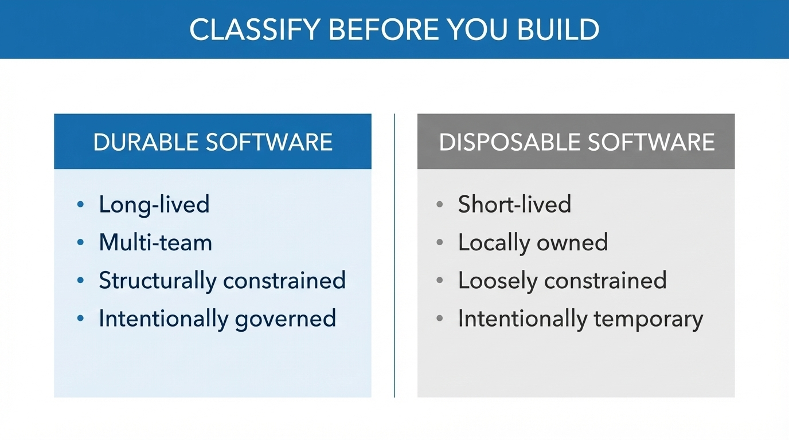
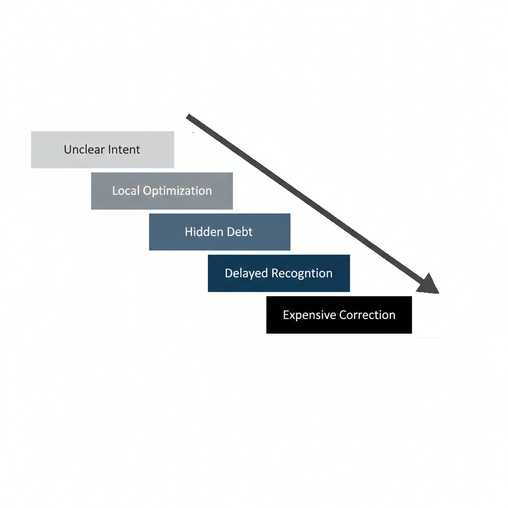
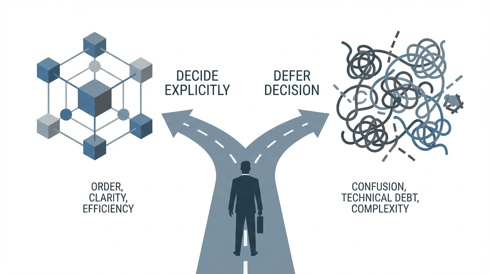

## Introduction

This series began with a simple observation: what makes software "good" now means different things to different people.

Some software is built to last, while some is designed to solve a problem quickly. Both are valid. Confusing them is not.

The confusion is expensive. [McKinsey research](https://www.mckinsey.com/capabilities/mckinsey-digital/our-insights/breaking-technical-debts-vicious-cycle-to-modernize-your-business) estimates technical debt accounts for 40% of IT balance sheets. The [American Enterprise Institute](https://www.aei.org/technology-and-innovation/inside-techs-2-trillion-technical-debt/) places the annual cost at $2.41 trillion in the United States. These are not abstract numbers. They reflect the cost of decisions left unmade.

This final article synthesizes the series and makes the leadership implications unavoidable.

⸻

## Two Definitions, One Decision

Across the series, two categories have emerged consistently.

**Durable software** is:
* long-lived
* multi-team
* structurally constrained
* intentionally governed

**Disposable software** is:
* short-lived
* locally owned
* loosely constrained
* intentionally temporary

The failure mode is not choosing a category. It is not choosing at all.

When leadership avoids classification, systems default to accidental permanence. They become too embedded to delete, too fragile to extend, and too unclear to own. Part 5 documented this pattern: democratization accelerates creation, but responsibility does not scale with it.


    

        
        
            <strong>Classification is not optional. It is the first leadership act.</strong> ∙ 02 January 2026 at 1:47 pm
        
    



⸻

## The Pattern That Destroys Software

Across all six articles, one pattern repeats.

**Step 1: Unclear leadership intent.**
A system is approved without answering basic questions. What kind of software is this? How long should it live? Who owns it over time?

**Step 2: Local optimization.**
Teams build what they can, as fast as they can, with the tools available. [GitClear's 2025 research](https://www.gitclear.com/ai_assistant_code_quality_2025_research) found an 8-fold increase in duplicated code blocks during 2024, with copy-pasted lines exceeding refactored lines for the first time in measurement history.

**Step 3: Hidden debt.**
The [2024 DORA Report](https://cloud.google.com/blog/products/devops-sre/announcing-the-2024-dora-report) found that a 25% increase in AI adoption is associated with a 7.2% decrease in delivery stability. Developers feel more productive. The system becomes more fragile. These facts coexist.

**Step 4: Delayed recognition.**
Problems surface under different budgets, with other leaders. [30% of CIOs](https://www.mckinsey.com/capabilities/mckinsey-digital/our-insights/demystifying-digital-dark-matter-a-new-standard-to-tame-technical-debt) report that more than 20% of their budget ostensibly dedicated to new products is actually diverted to resolving tech debt issues.

**Step 5: Expensive correction.**
By this point, options have narrowed. [BCG research](https://www.bcg.com/publications/2024/software-projects-dont-have-to-be-late-costly-and-irrelevant) found that 31.1% of software projects are canceled before completion, and only 16.2% are delivered on time and on budget.

This pattern is not new. AI only makes it faster.


    

        
        
            <strong>The pattern repeats. AI only makes it faster.</strong> ∙ 02 January 2026 at 1:47 pm
        
    



⸻

## Leadership Is About Intent

Good software does not emerge from frameworks, tooling, or velocity.

It emerges from intent.

[BCG's 2024 survey](https://www.bcg.com/publications/2024/software-projects-dont-have-to-be-late-costly-and-irrelevant) concluded that "improving the outcomes of IT projects at most companies will depend squarely on technology leadership creating the proper requirements and culture for teams to be able to deliver." The report found that CIOs and CTOs are "all too often either left out of the overall decision-making process when a technology implementation is initiated, or they fail to plainly set expectations for what an investment in a new application will specifically deliver."

This is not a process failure. It is a leadership failure.

Leadership must provide:
* clarity of purpose
* boundaries of responsibility
* permission to stop
* discipline to remove

Management executes within these constraints. Engineering builds within them. AI accelerates within them.

Without intent, acceleration only magnifies chaos.


    

        
        
            <strong>Intent determines destination. Deferral is not flexibility.</strong> ∙ 02 January 2026 at 1:47 pm
        
    



⸻

## The Questions Leaders Must Answer

Before approving any software initiative, leaders should be able to answer:

1. **What kind of software is this?**
   Is it durable or disposable? If durable, what governance applies? If disposable, what is the explicit end date?

2. **How long should it live?**
   [Forrester research](https://neontri.com/blog/build-vs-buy-software/) found that 78% of total lifetime software cost accrues after launch. A system without a defined lifespan has an infinite cost curve.

3. **Who owns it over time?**
   Part 5 introduced the concept of "institutional orphan software," systems that exist, are used, and are often critical, but for which no one feels responsible. This is a leadership failure, not a staffing problem.

4. **What happens when it fails?**
   [90% of IT decision makers](https://www.recordpoint.com/roadmap-to-sunsetting-legacy-systems) say legacy systems block innovation. The cost of not answering this question is measured in years of delayed modernization.

5. **How does it end?**
   Architecture without retirement is not architecture. It is an accumulation.

If these questions feel uncomfortable, that discomfort is a signal.

⸻

## Connecting the Series

This article does not stand alone.

* [Part 1](/posts/2025-12-04-good_software_pt1/) defined the split between durable and disposable software
* [Part 2](/posts/2025-12-09-good_software_pt2/) exposed leadership failures that create debt
* [Part 3](/posts/2025-12-14-good_software_pt3/) showed how debt becomes exponential through three vectors: model drift, generation bloat, and organizational fragmentation
* [Part 4](/posts/2025-12-19-good_software_pt4/) demonstrated how team dynamics and mentorship erode when "the team" is one person plus AI
* [Part 5](/posts/2025-12-24-good_software_pt5/) introduced the five-dimension classification model and the democratization paradox
* [Part 6](/posts/2025-12-29-good_software_pt6/) provided the build, buy, or dispose framework

Part 7 answers the final question: what must leaders accept to make any of this work?

⸻

## What This Demands From Leadership

The series has documented tools, frameworks, and classification models. None of them matters without leadership willing to use them.

**Accept that speed is not strategy.**
[75% of IT executives](https://teamstage.io/project-management-statistics/) anticipate their software projects will fail. The problem is not velocity. The problem is building faster in the wrong direction.

**Accept that AI changes nothing fundamental.**
AI accelerates creation. It does not create intent. As [Kin Lane](https://www.linkedin.com/in/kinlane/), *the first* API evangelist with 35 years in technology, [told LeadDev](https://leaddev.com/software-quality/how-ai-generated-code-accelerates-technical-debt): "I don't think I have ever seen so much technical debt being created in such a short period of time during my 35-year career in technology."

**Accept that clarity requires saying no.**
Every system approved without classification is a decision to defer consequences. Deferral is not flexibility. It is an avoidance with compounding interest.

**Accept that retirement is leadership discipline.**
Part 6 documented that [delayed modernization costs](https://you.stonybrook.edu/freedom/2025/11/08/legacy-system-retirement-decisions-among-enterprise-organizations/) range from $300K per year for small firms to $7.3M per year for large enterprises. Systems do not retire themselves. Leaders retire systems.

⸻

## The Road Ahead

AI is not changing what good software is. It is changing how fast bad decisions compound.

The organizations that succeed will not be those that adopt AI fastest. They will be those who maintain clarity. They will classify before they build, fund maintenance deliberately, and retire systems without nostalgia.

This is not a technical challenge. It is a leadership challenge.

The [CTO trap](/posts/2020-03-16-cto-trap/) I wrote about years ago has not changed. Technical mastery still becomes total responsibility. The escape route is still the same: acknowledge limits, delegate, and foster collaboration among leaders who share a clear vision.

What has changed is the cost of not escaping. When building was slow, unclear intent created problems over the years. When building is fast, unclear intent creates problems over the weeks.

⸻

## Closing

Good software in 2025 is not about elegance. It is not about cleverness. It is about knowing what you are building before you build it, and accepting the consequences of that choice.

Leadership is the act of consciously choosing consequences.

Management is the act of executing those choices.

AI does not change this distinction. It only removes the illusion that we can avoid it.

The trap was always there. Now there is nowhere left to hide.

⸻

## References

### Technical Debt and Cost

* McKinsey (2023). "Breaking technical debt's vicious cycle to modernize your business." https://www.mckinsey.com/capabilities/mckinsey-digital/our-insights/breaking-technical-debts-vicious-cycle-to-modernize-your-business

* American Enterprise Institute (2025). "Inside Tech's $2 Trillion Technical Debt." https://www.aei.org/technology-and-innovation/inside-techs-2-trillion-technical-debt/

* McKinsey (2022). "Demystifying digital dark matter: A new standard to tame technical debt." https://www.mckinsey.com/capabilities/mckinsey-digital/our-insights/demystifying-digital-dark-matter-a-new-standard-to-tame-technical-debt

* McKinsey (2020). "Tech debt: Reclaiming tech equity." https://www.mckinsey.com/capabilities/mckinsey-digital/our-insights/tech-debt-reclaiming-tech-equity

### AI and Code Quality

* Google DORA (2024). "Accelerate State of DevOps Report 2024." https://cloud.google.com/blog/products/devops-sre/announcing-the-2024-dora-report

* GitClear (2025). "AI Copilot Code Quality: 2025 Data Suggests 4x Growth in Code Clones." https://www.gitclear.com/ai_assistant_code_quality_2025_research

* LeadDev (2025). "How AI-generated code accelerates technical debt." https://leaddev.com/software-quality/how-ai-generated-code-accelerates-technical-debt

### Project Failure and Leadership

* BCG (2024). "Software Projects Don't Have to Be Late, Costly, and Irrelevant." https://www.bcg.com/publications/2024/software-projects-dont-have-to-be-late-costly-and-irrelevant

* TeamStage (2024). "Project Management Statistics 2024." https://teamstage.io/project-management-statistics/

* Standish Group CHAOS Report, via ZipDo (2024). "Essential Software Project Failure Statistics." https://zipdo.co/statistics/software-project-failure/

### Legacy and Modernization

* RecordPoint. "Roadmap to Sunsetting Legacy Systems." https://www.recordpoint.com/roadmap-to-sunsetting-legacy-systems

* Stony Brook University (2025). "Legacy System Retirement Decisions Among Enterprise Organizations." https://you.stonybrook.edu/freedom/2025/11/08/legacy-system-retirement-decisions-among-enterprise-organizations/

* Forrester Total Economic Impact (2024), via Neontri. "Build vs Buy Software." https://neontri.com/blog/build-vs-buy-software/

### Related Articles From This Blog

* [The CTO Trap](/posts/2020-03-16-cto-trap/)
* [The Cultural Compass](/posts/2020-08-16-the_cultural_compass/)
* [The Enforcement Trap](/posts/2025-10-09-enforcement_trap/)
* [The micro-apps revolution](/posts/2025-11-04-micro_apps_revolution/)
* [When Infrastructure Fails](/posts/2025-11-11-multi-az-not-enough/)